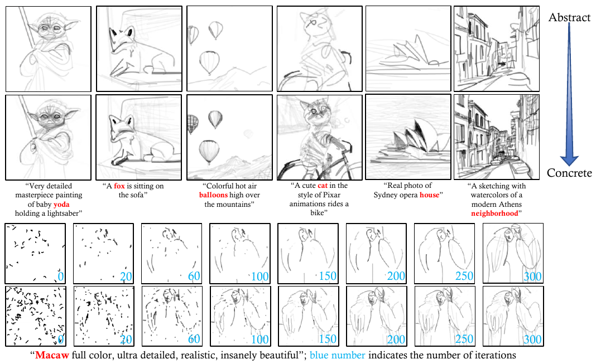

# DiffSketcher: Text Guided Vector Sketch Synthesis through Latent Diffusion Models

[](https://arxiv.org/abs/2306.14685) [](https://arxiv.org/abs/2306.14685)

This repository contains our official implementation of NeurIPS 2023
paper: [DiffSketcher: Text Guided Vector Sketch Synthesis through Latent Diffusion Models](https://arxiv.org/abs/2306.14685),
which can enerate high quality SVG based on text. Our project page
is [here](https://ximinng.github.io/DiffSketcher-project/).



## :new: Update

- [10/2023] We released the DiffSketcher code.
- [10/2023] We released the [VectorFusion code](https://github.com/ximinng/VectorFusion-pytorch).

### TODO

- [ ] Add a webUI demo.
- [ ] Add support for colorful results and oil painting.

## :wrench: Installation

Create a new conda environment:

```shell
conda create --name diffsketcher python=3.10
conda activate diffsketcher
```

Install pytorch and the following libraries:

```shell
conda install pytorch==1.13.1 torchvision==0.14.1 torchaudio==0.13.1 pytorch-cuda=11.6 -c pytorch -c nvidia
pip install hydra-core omegaconf BeautifulSoup4
pip install opencv-python scikit-image matplotlib visdom wandb
pip install triton numba
pip install numpy scipy timm scikit-fmm einops
pip install accelerate transformers safetensors datasets
```

Install CLIP:

```shell
pip install ftfy regex tqdm
pip install git+https://github.com/openai/CLIP.git
```

Install diffusers:

```shell
pip install diffusers==0.20.2
```

Install xformers (require `python=3.10`):

```shell
conda install xformers -c xformers
```

Install diffvg:

```shell
git clone https://github.com/BachiLi/diffvg.git
cd diffvg
git submodule update --init --recursive
conda install -y -c anaconda cmake
conda install -y -c conda-forge ffmpeg
pip install svgwrite svgpathtools cssutils torch-tools
python setup.py install
```

## 🔥 Quickstart

Example:

```shell
python run_painterly_render.py \ 
  -c diffsketcher.yaml \
  -eval_step 10 -save_step 10 \
  -update "token_ind=2 num_paths=96 sds.warmup=1500 num_iter=2000" \ 
  -pt "A horse is drinking water by the lake" \ 
  -respath ./workdir/draw_horse \ 
  -d 998 \
  --download
```

- `-c` a.k.a `--config`: configuration file.
- `-eval_step`: the step size used to eval the method (**too frequent calls will result in longer times**).
- `-save_step`: the step size used to save the result (**too frequent calls will result in longer times**).
- `-update`: a tool for editing the hyper-params of the configuration file, so you don't need to create a new yaml.
- `-pt` a.k.a `--prompt`: text prompt.
- `-respath` a.k.a `--results_path`: the folder to save results.
- `-d` a.k.a `--seed`: random seed.
- `--download`: download models from huggingface automatically **when you first run them**.

optional:

- `-npt`, a.k.a `--negative_prompt`: negative text prompt.
- `-mv`, a.k.a `--make_video`: make a video of the rendering process (**it will take much longer**).
- `-frame_freq`, a.k.a `--video_frame_freq`: control video frame.
- **Note:** [Download](https://huggingface.co/akhaliq/CLIPasso/blob/main/u2net.pth) U2Net model and place in `checkpoint/` dir if `xdog_intersec=True`

**check the [Code Run List](https://github.com/ximinng/DiffSketcher/blob/main/run.md) for more scripts.**

## :books: Acknowledgement

The project is built based on the following repository:

- [BachiLi/diffvg](https://github.com/BachiLi/diffvg)
- [yael-vinker/CLIPasso](https://github.com/yael-vinker/CLIPasso)
- [huggingface/diffusers](https://github.com/huggingface/diffusers)

We gratefully thank the authors for their wonderful works.

## :paperclip: Citation

If you use this code for your research, please cite the following work:

```
@article{xing2023diffsketcher,
  title={DiffSketcher: Text Guided Vector Sketch Synthesis through Latent Diffusion Models},
  author={Xing, Ximing and Wang, Chuang and Zhou, Haitao and Zhang, Jing and Yu, Qian and Xu, Dong},
  journal={arXiv preprint arXiv:2306.14685},
  year={2023}
}
```

## :copyright: Licence

This work is licensed under a MIT License.